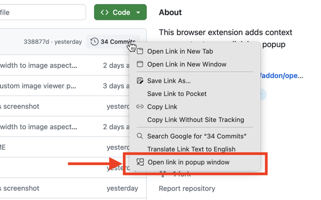
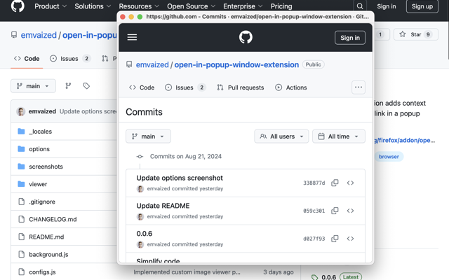
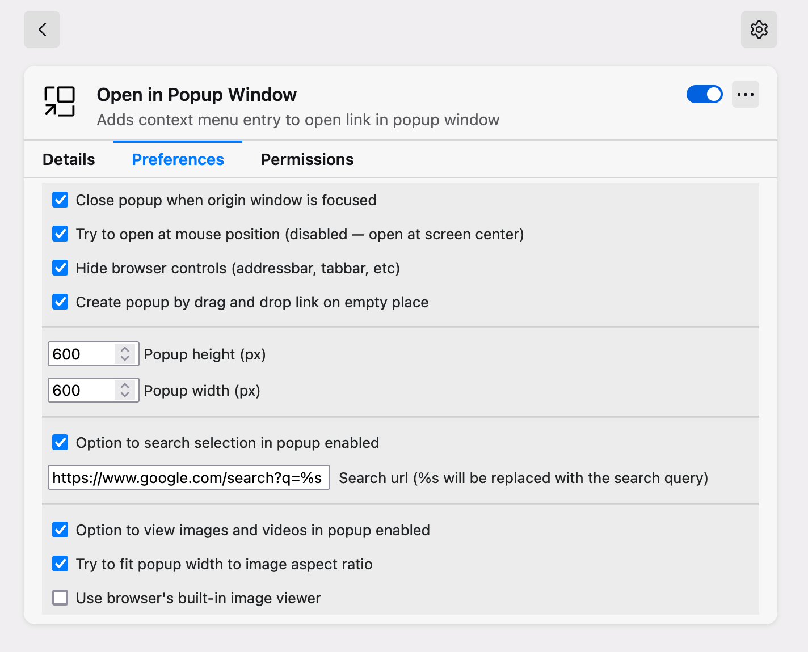
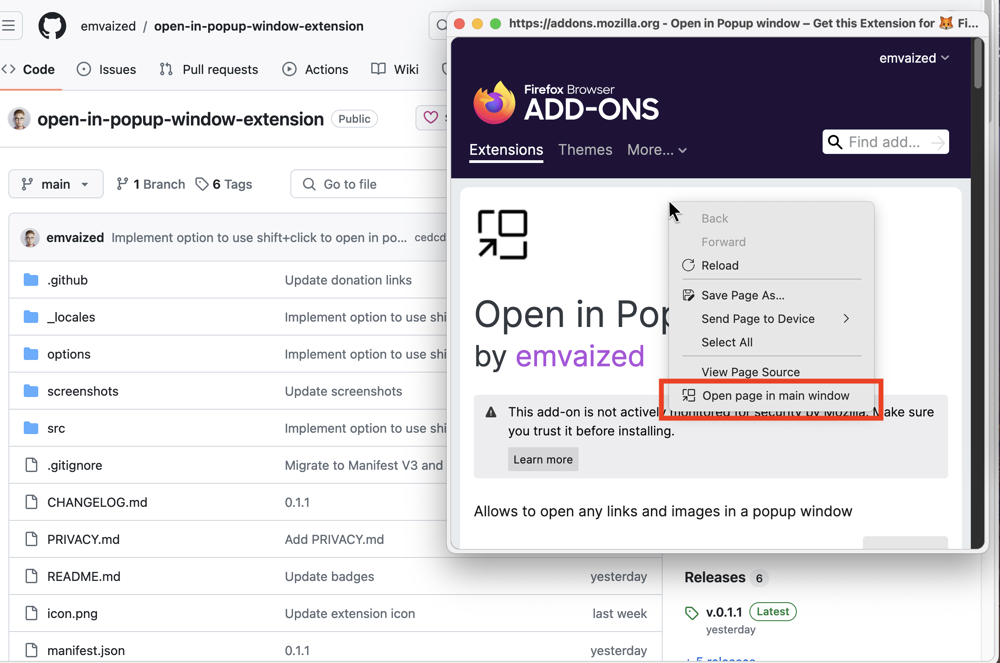

#  Open in Popup Window

This tiny and lightweight browser extension provides ability to quickly preview links without leaving the current page context. It adds entry in context menu of links, and when clicked, opens new small window at cursor position, with no tab bar and addressbar. 

<b>Features:</b>
- [x] Ability to open images and search selected text in popup window
- [x] Use <kbd>Shift</kbd> + click to open in popup window (_disabled_ by default)
- [x] Use drag and drop to open in popup window (_disabled_ by default)
- [x] Configurable popup height, width and position on screen
- [x] Option to close popup window when origin window regains focus
- [x] New popups can be opened from existing popups
- [x] Automatically reopen new single tab windows as popup windows ([more info](https://github.com/emvaized/open-in-popup-window-extension?tab=readme-ov-file#how-to-use-the-new-feature-reopen-new-single-tab-windows-as-popup-windows))
- [x] Automatically reopen tabs opened from page as popup windows ([more info](https://github.com/emvaized/open-in-popup-window-extension?tab=readme-ov-file#how-to-use-reopen-tabs-opened-by-page-as-popup-windows))
- [x] Customizable [keyboard hotkeys](https://github.com/emvaized/open-in-popup-window-extension?tab=readme-ov-file#what-keyboard-hotkeys-are-available)

This extension is intended to be used as an analogue of <i>Safari Link Preview</i>, <i>Arc Peek</i> or <i>Zen Glance</i>. It's a great way to preview links, which works everywhere and is not affected by the CORS problem like other extensions which are using `iframe` element for the link preview.

 &nbsp; 

## Screenshots

## Support project ❤️
If you really enjoy this project, please consider supporting its further development by making a small donation using one of the options below! 

 &nbsp;  &nbsp;  &nbsp; 

## FAQ (Frequently Asked Questions)

#### How to close the popup using keyboard?
> - <kbd>Alt</kbd> + <kbd>F4</kbd>
> - <kbd>Ctrl</kbd> + <kbd>W</kbd>
> - <kbd>Escape</kbd> key (if enabled in the extension settings)

#### What keyboard hotkeys are available? 
> This extension implements the following keyboard hotkeys: 
> 
> | Action Description                                      | Default Hotkey         |
> |---------------------------------------------------------|-------------------------|
> | Open popup window in the main window                    | <kbd>Alt</kbd> + <kbd>Y</kbd>      |
> | Open the currently opened page in a popup window        | <kbd>Alt</kbd> + <kbd>P</kbd>      |
> | Search selected text in a popup window  *(or open empty search page if no selected text found)*| <kbd>Alt</kbd> + <kbd>S</kbd>      |
> 
> You can change these hotkeys these ways: 
> - In Chromium-based browsers (Chrome, Edge, Vivaldi, Brave etc), navigate to `chrome://extensions/shortcuts` and scroll down to *Open in Popup Window* category
> - In Firefox, navigate to `about:addons`, click cogwheel icon in top right corner and select "Manage Extension Shortcuts" ([more details](https://support.mozilla.org/en-US/kb/manage-extension-shortcuts-firefox))

#### How to open page from the popup in the main window? 
> You can do it in 2 ways: 
> - By right clicking on the page in popup window and selecting "Open page in main window"
> - <kbd>Alt</kbd> + <kbd>Enter</kbd> hotkey (if <kbd>Esc</kbd> hotkey is enabled in extension settings)
> 
> 

>     
Demonstration

>     
> 

#### On Mac OS, popup windows do not appear in the fullscreen mode
> Due to the specifics of fullscreen mode on Mac OS (fullscreen apps separate in their own Desktop space), popup windows do not appear above the fullcreen window. They either open on the "main" desktop (Firefox), or as a new fullscreen window (Chrome). To use this extension on Mac OS, you would have to open browser not in the fullscreen mode.

#### How to make popups remain always on top? 
> Unfortunately, browser extensions currently are [not capable](https://github.com/w3c/webextensions/issues/443) of manually setting "always on top" flag. 
>
> But you can use third-party programs in your system which can do it, for example [PowerToys](https://github.com/microsoft/PowerToys) on Windows. Don't forget to disable autoclosing popup window when it loses focus in the extension settings.

#### How to use the new feature "Reopen new single tab windows as popup windows"?

> This powerful feature, introduced in version `0.3`, allows to extend extension abilities and open any link anywhere as a popup window. With this option enabled, extension will be waiting in the background for any new windows to open, and once a new window with only one tab opens, it will reopen it as a popup. 
>
> This way it can operate with links, which it couldn't access otherwise, for example: sites on new tab page, in bookmarks panel, links on browser-protected pages (`chrome://`, `about:`) etc. You could create a popup window the following ways:
>
> - Using right click context menu and selecting "Open in new window"
> - <kbd>Shift</kbd> + left click in Firefox (+ <kbd>Ctrl</kbd> in Chrome) – this will essentially duplicate extension's "Open with shift+click" option
> - <kbd>Shift</kbd> + <kbd>Enter</kbd> in Firefox (+ <kbd>Ctrl</kbd> in Chrome) on any focused element, for example search suggestion in address bar
> 
> Popup windows opened this way could not be positioned by mouse cursor location, so an alternative "Fallback popup window location" setting will be used ("Center" by default)

#### How to use "Reopen tabs opened by page as popup windows"?

> With this option enabled, new tabs opened by another tab (usually those opened by clicking links with `target: _blank`) will be automatically reopened as popup windows. This setting has an additional option to do it only for pinned tabs, which is _enabled_ by default.

#### Private windows are not reopened as popups with this option enabled

> You might need to manually allow this extension to run in private windows

#### How to reopen externally opened links as popup windows — similar to _Little Arc_ feature from the Arc browser? 

> It is possible in Firefox by toggling the `Reopen new single tab windows as popup windows` feature and setting `browser.link.open_newwindow.override.external` config to `2` on `about:config` page

## Troubleshooting
- ⚠️ If "Open by drag" and "Shift+click to open" options not working, or the popup window always gets positioned in the top left corner no matter the placement settings, please make sure you gave extension all permissions to run on every page you visit!
- It was also previously [reported](https://github.com/emvaized/open-in-popup-window-extension/issues/1#issuecomment-1637067834) that Firefox Multi-Account Containers might interfere with "Search in popup" action, enforcing it's own redirection and preventing popup window from opening. If you face such issues, I recommend using another search URL in the extension settings

## Building
- `npm install` to install all dependencies
- `npm run build` to generate `dist` folder with minimized code of the extension

## Ideas for future updates
- [ ] Option to remember popup window size on manual resize (_improssible in Firefox_ – [bug report](https://bugzilla.mozilla.org/show_bug.cgi?id=1762975))
- [ ] Option to open page in the main window on clicking "Maximize" window button (_improssible in Firefox_ – [bug report](https://bugzilla.mozilla.org/show_bug.cgi?id=1762975))
- [ ] Option to keep popup windows always on top (_improssible in both Chrome and Firefox_ – [bug report](https://github.com/w3c/webextensions/issues/443))

## Privacy
This extension doesn't collect any private data. It only requires access to currently open page in order to fetch information about the object under cursor when drag and drop event occured or context menu was opened.