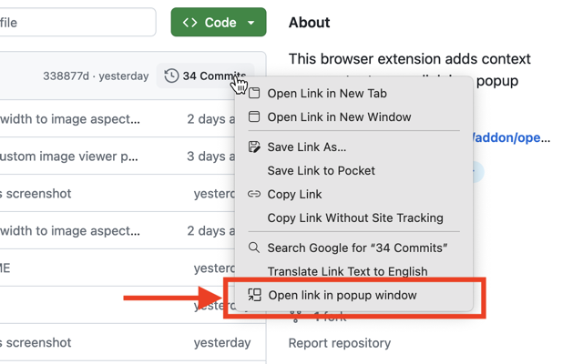
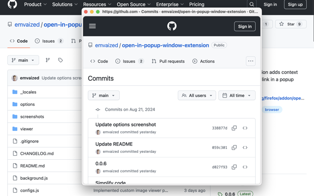
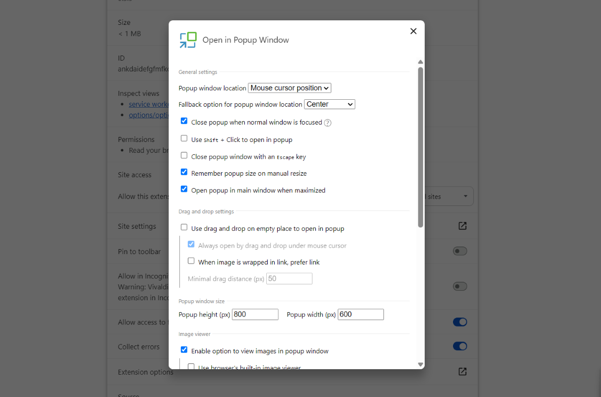

#  Open in Popup Window

[](https://microsoftedge.microsoft.com/addons/detail/open-in-popup-window/ongbhnbepfbmoabelbmjppkjhiboicgp)

 

This tiny and lightweight browser extension provides ability to quickly preview links without leaving the current page context. It adds entry in context menu of links, and when clicked, opens new small window at cursor position, with no tab bar and addressbar. 

This extension is intended to be used as an analogue of <i>Safari Link Preview</i>, <i>Arc Peek</i> or <i>Zen Glance</i>. It's a great way to preview links, which works everywhere and is not affected by the CORS problem like other extensions which are using `iframe` element for the link preview.

  &nbsp; 

<h4>Features</h4>

- [x] Open links, images and search selected text in a popup window
- [x] Configurable popup height, width and default position on the screen
- [x] Several ways to open in popup window: 
    - [x] Context menu
    - [x] Keyboard hotkeys ([more info](https://github.com/emvaized/open-in-popup-window-extension/wiki/FAQ-(Frequently-Asked-Questions)#what-keyboard-hotkeys-are-available))
    - [x] Drag and drop
    - [x] Modifier key + left click (possible options: <kbd>Shift</kbd> / <kbd>Ctrl</kbd> / <kbd>Alt</kbd> / <kbd>Meta</kbd>)
    - [x] Double press modifier key when item is hovered
    - [x] Long click mouse button (left/middle/right)
    - [x] Click on toolbar icon (search/open current page in popup)
- [x] Super lightweight, with content script being less then 10 KBs
- [x] Advanced Image Viewer with GIF playback control
- [x] Close popup window when origin window regains focus (excludes minimized and "always-on-top" windows)
- [x] Dim page when popup window is opened
- [x] Remember popup window size on manual resize (_only Chrome_ ~ [Firefox bug report](https://bugzilla.mozilla.org/show_bug.cgi?id=1762975))
- [x] Open popup page in the main window on maximize (_only Chrome_ ~ [Firefox bug report](https://bugzilla.mozilla.org/show_bug.cgi?id=1762975))
- [x] Automatically reopen new single tab windows, and tabs opened by page, as popup windows (like [Little Arc](https://resources.arc.net/hc/en-us/articles/19235387524503-Little-Arc-Quick-Lookups-Instant-Triaging)) — [more info here](https://github.com/emvaized/open-in-popup-window-extension?tab=readme-ov-file#how-to-use-the-new-feature-reopen-new-single-tab-windows-as-popup-windows)

## Screenshots

    
Options page

    

## Support project ❤️
If you really enjoy this project, please consider supporting its further development by making a small donation using one of the options below! 

 &nbsp;  &nbsp;  &nbsp; 

## Troubleshooting
If "Open by drag" and "Mod+click to open" options not working, or the popup window always gets positioned in the top left corner no matter the placement settings, please make sure you gave extension all permissions to run on every page you visit!

## FAQ (Frequently Asked Questions) ⚠️
See answers to some common questions on the [Wiki page](https://github.com/emvaized/open-in-popup-window-extension/wiki/FAQ-(Frequently-Asked-Questions))

## Building
- `npm install` to install all dependencies
- `npm run build` to generate `dist` folder with minimized code of the extension, or
- `npm run build.chrome` to create chromium-specific version with few changes

## Ideas for future releases
- [ ] Option to keep popup windows always on top (_improssible until_ [bug report](https://github.com/w3c/webextensions/issues/443))
- [ ] Option to open popup windows in _incognito_ mode
- [ ] Use text selection coordinates to align the "search" popup window when opened with keyboard shortcut
- [ ] Option to translate selected text in popup window, with dedicated keyboard hotkey

## Privacy
This extension doesn't collect any private data. It requires access to currently open page in order to fetch information about the object under cursor and the screen coordinates, as well as inject scripts for custom triggers (drag and drop, shift+click etc). Without such access, only opening popups from context menu will work, but the popup positioning might be incorrect.

## Some of my other projects
*  [SelectON](https://github.com/emvaized/selecton-extension) – smart popup with actions on text selection 
*  [Circle Mouse Gestures](https://github.com/emvaized/circle-mouse-gestures) – better mouse gestures, with visual representation of all available actions
*  [Text reflow on zoom](https://github.com/emvaized/text-reflow-on-zoom-mobile) – userscript and mobile browser extension which reflows all text after a pinch gesture
*  [Modern Inverted Mouse Cursors](https://www.patreon.com/emvaized/shop/modern-inverted-mouse-cursors-for-10-11-924356) – cursor pack for Windows 10/11 which inverts all colors behind cursors 