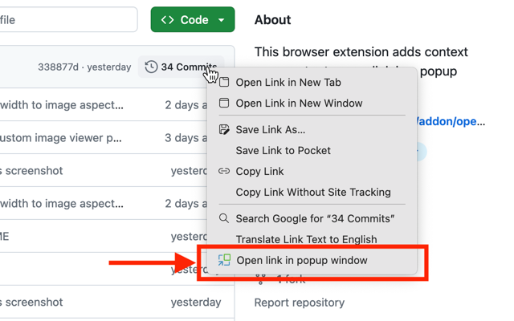

This extension was created to provide ability to quickly preview links without leaving the current page context. It adds entry in context menu of links, and when clicked, opens new small window at mouse position without browser controls.

Extension provides several options for popup height/width, whether to show browser controls, and whether to close the popup when origin window regains focus (for example clicked outside of popup).

Privacy:
This extension doesn't collect any private data. It requires access to currently open page in order to get mouse coordinates when context menu was opened.

